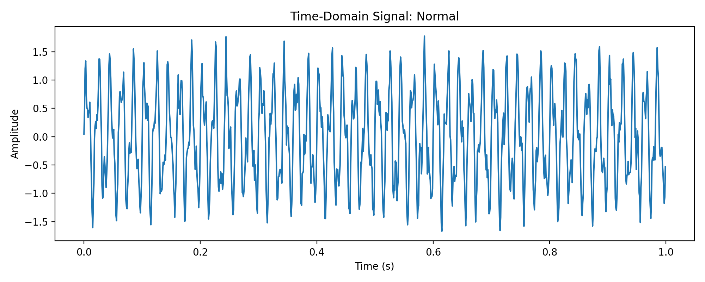
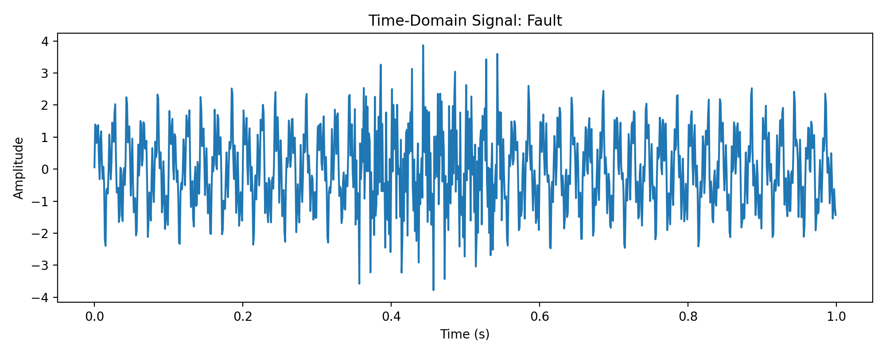
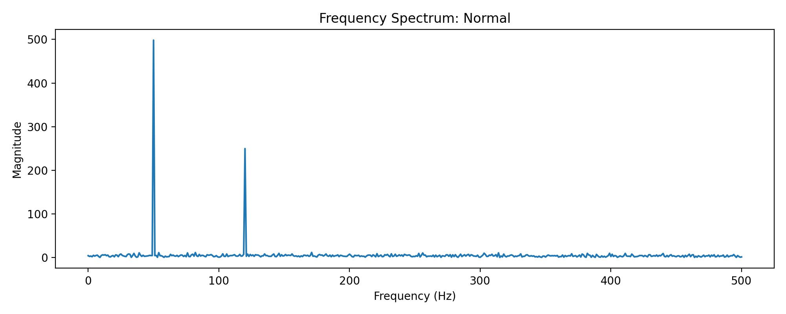
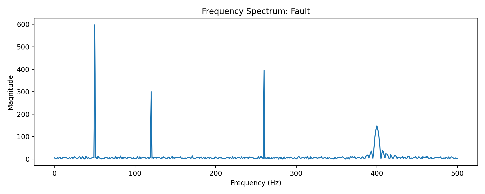
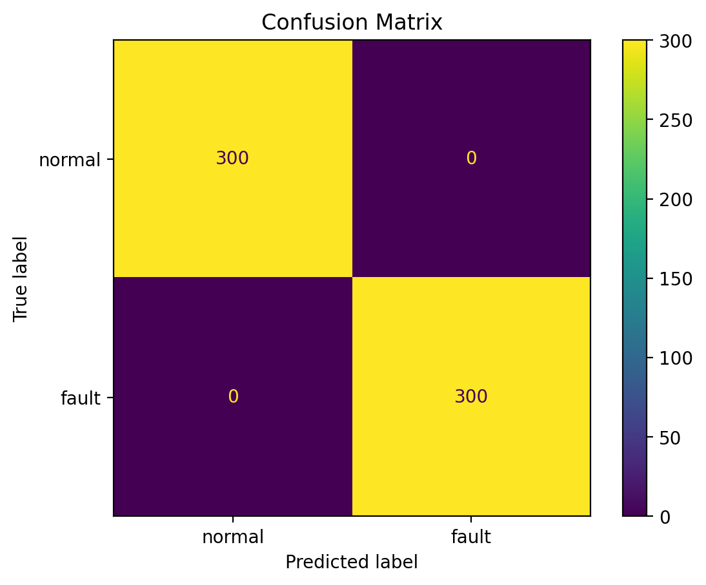
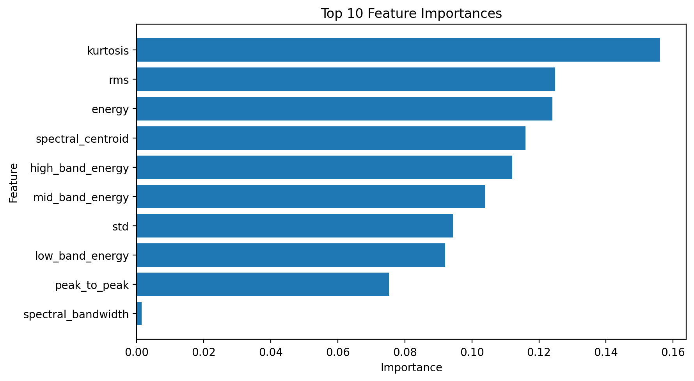

## Results Preview
This project demonstrates signal-based fault detection using machine learning on simulated sensor data.

# Signal Processing Fault Detection with Machine Learning

A signal processing and machine learning project for detecting faults in sensor data using time-domain and frequency-domain analysis.
---

## 🚀 Project Overview

This project demonstrates a full engineering pipeline:

- Signal generation (normal vs fault)
- Signal visualization (time + frequency domain)
- Feature extraction (statistical + spectral)
- Machine learning classification
- Model evaluation

---

## 🧠 Key Concepts

- Signal Processing (Fourier Transform)
- Feature Engineering
- Machine Learning Pipeline
- Engineering Diagnostics

---

## 📂 Project Structure

```
signal-processing-fault-detection-ml/
├── data/
├── models/
├── outputs/
│   ├── figures/
│   └── reports/
├── src/
│   ├── generate_data.py
│   ├── features.py
│   ├── train.py
│   ├── evaluate.py
│   ├── visualize.py
│   └── run_pipeline.py
├── tests/
├── docs/
├── notebooks/
├── requirements.txt
└── README.md
```

---

## ⚙️ How It Works

### Signal Types
- Normal signal: low-frequency + noise  
- Fault signal: high-frequency + bursts  

---

## 📊 Results

### Time-domain




### Frequency-domain




### Model Evaluation




---
## 📈 Performance

The model achieves very high accuracy on the dataset.

Note: Since the dataset is synthetically generated with clearly separable signal patterns, near-perfect accuracy is expected. This project focuses on demonstrating the full signal processing and machine learning pipeline, including feature extraction and system-level analysis, rather than optimizing for real-world generalization.
---
## ▶️ How to Run

### 1. Create environment
```bash
python -m venv .venv
```

### 2. Activate environment
```bash
.venv\Scripts\activate
```

### 3. Install dependencies
```bash
pip install -r requirements.txt
```

### 4. Run pipeline
```bash
python src/run_pipeline.py
```

---

## 🧪 Testing
```bash
pytest
```

---

## 🛠️ Technologies
- Python
- NumPy
- Pandas
- SciPy
- Scikit-learn
- Matplotlib

---

## 🎯 Relevance
- Signal Processing
- Machine Learning
- Embedded Systems
- Sensor Data Analysis

## Real-World Applications

- Ultrasonic inspection systems
- Predictive maintenance
- Sensor-based anomaly detection
- Embedded signal monitoring
- Industrial diagnostics
---

## 👤 Author
Ashiqur Rahman Rahul
